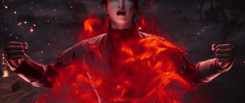
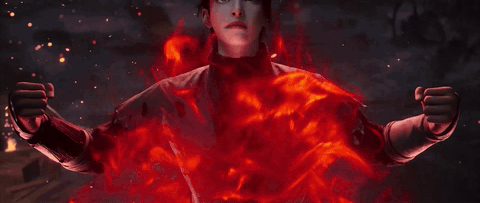
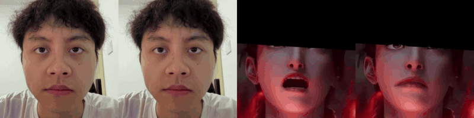

<div align="center">

# PerformRecast: Expression and Head Pose Disentanglement for Portrait Video Editing

**CVPR 2026**

[Jiadong Liang](https://github.com/dongdongdong666)<sup>\*</sup> &nbsp;·&nbsp;
[Bojun Xiong](https://ymxbj.github.io/)<sup>\*</sup> &nbsp;·&nbsp;
[Jie Tian](https://github.com/takiee) &nbsp;·&nbsp;
[Hua Li](https://github.com/grovessss) &nbsp;·&nbsp;
[Xiao Long](https://github.com/LongXiao2001) &nbsp;·&nbsp;
[Yong Zheng](https://openreview.net/profile?id=~Yong_Zheng3) &nbsp;·&nbsp;
[Huan Fu](https://huan-fu.github.io/)<sup>†</sup>

HUJING Digital Media &amp; Entertainment Group

<sub><sup>\*</sup> Equal contribution &nbsp;&nbsp; <sup>†</sup> Corresponding author</sub>

[Project page](https://youku-aigc.github.io/PerformRecast/) ·
[arXiv](https://arxiv.org/abs/2603.19731)

</div>

---

## Overview

PerformRecast is an inference framework for **expression-only portrait video
editing**: given a *source* portrait video and a *driving* portrait video, it
transfers the driving expression onto the source while **preserving the source
head pose, identity and appearance**. The key idea is an explicit
disentanglement between facial expression and head pose at the implicit-keypoint
level, which lets the model edit a subject's **facial expression** without
ever touching their **head pose**.

This repository contains the official inference code, configuration files and
helper utilities used to produce the results in the paper.

> **Note.** PerformRecast builds on top of
> [LivePortrait](https://github.com/KlingAIResearch/LivePortrait) — the appearance
> feature extractor (F), motion extractor (M), warping module (W) and SPADE
> generator (G) are re-trained for the disentangled-expression formulation
> proposed in our paper. Please cite both works when using this code.

<table>
<tr>
  <th>Source</th>
  <th>Edited result</th>
</tr>
<tr>
  <td></td>
  <td></td>
</tr>
</table>

Side-by-side comparison &nbsp;·&nbsp; `[reference | driving | source-crop | edited-crop]`:



## Method Overview

PerformRecast follows a four-stage inference pipeline:

1. **Crop & align** the source and driving videos with InsightFace + a
   203-points landmark detector.
2. **Encode appearance** of every source frame with a DINOv2-augmented 3D
   feature extractor *F*.
3. **Extract motion** (canonical keypoints, head pose, scale, translation,
   expression delta) from each source / driving / reference frame with a
   ConvNeXt V2 motion extractor *M*.
4. **Recompose** the driving expression onto the *source* head pose and
   identity, then warp / decode with the warping module *W* and SPADE
   generator *G*.

Two inference modes control how the source and driving expressions are
fused:

| `--inference-mode` | Behaviour                                                                |
| :----------------: | :----------------------------------------------------------------------- |
|        `1`         | **Replacement.** Replace the source expression with the driving expression. |
|        `2`         | **Enhancement.** Add the driving expression *delta* on top of the source.   |

`--inference-mode 1` is the recommended default for editing scenarios.

## Repository layout

```
PerformRecast/
├── inference.py                # CLI entry point
├── src/
│   ├── pipeline.py             # PerformRecastPipeline (end-to-end)
│   ├── wrapper.py              # PerformRecastWrapper (loads F / M / W / G)
│   ├── config/
│   │   ├── argument_config.py  # CLI arguments
│   │   ├── inference_config.py # checkpoint paths & runtime flags
│   │   ├── crop_config.py      # face-crop parameters
│   │   └── performrecast_models.yaml
│   ├── modules/                # Network definitions (F / M / W / G + utils)
│   └── utils/                  # I/O, cropping, smoothing, helpers
├── scripts/
│   └── download_weights.sh     # One-shot Google Drive checkpoint downloader
├── assets/                     # Sample source / driving / reference clips + demo gifs
├── pretrained_weights/         # Place downloaded checkpoints here
├── animations/                 # Inference outputs are written here
├── requirements.txt
├── LICENSE
└── README.md
```

## Installation

The code has been tested on Python 3.12, CUDA 12.8, PyTorch 2.11 with NVIDIA V100 GPUs.

```bash
git clone https://github.com/youku-aigc/PerformRecast.git
cd PerformRecast

conda create -n performrecast python=3.12 -y
conda activate performrecast

# Install PyTorch matching your CUDA version, e.g.:
pip3 install torch==2.11.0 torchvision==0.26.0 torchaudio==2.11.0 --index-url https://download.pytorch.org/whl/cu128

pip3 install -r requirements.txt
```

`ffmpeg` (with both `ffmpeg` and `ffprobe`) must be available on your `PATH`.
On Ubuntu: `sudo apt install ffmpeg`. Alternatively drop a static `ffmpeg`
build into a `./ffmpeg/` folder at the repository root and it will be picked
up automatically.

## Pretrained weights

The fastest way to grab everything is the bundled script — it downloads
all seven artefacts into `pretrained_weights/`, unzips `buffalo_l.zip`
for you, and is safe to re-run after a partial download:

```bash
bash scripts/download_weights.sh
# Or, to use a different destination:
PERFORMRECAST_PRETRAINED=/path/to/weights bash scripts/download_weights.sh
```

After the script finishes, the layout looks like:

```
pretrained_weights/
├── performrecast/
│   ├── appearance_feature_extractor.pth   # F
│   ├── motion_extractor.pth               # M
│   ├── spade_generator.pth                # G
│   └── warping_module.pth                 # W
├── vit_base_patch16_224.dino/
│   └── pytorch_model.bin                   # DINO ViT-B/16 backbone (used inside F)
├── insightface/
│   └── models/buffalo_l/...                # face detector + 106-points landmark
└── landmark.onnx                           # 203-points landmark refiner
```

If you prefer to download manually, all checkpoints are hosted on Google Drive:

| File                                   | Download                                                                                              |
| -------------------------------------- | ----------------------------------------------------------------------------------------------------- |
| `appearance_feature_extractor.pth` (F) | [Google Drive](https://drive.google.com/file/d/1YnmRePhPjtKY3Us8C0Mg-VInGVSVepB5/view?usp=sharing) |
| `motion_extractor.pth`             (M) | [Google Drive](https://drive.google.com/file/d/1VhcFZrTCpJvSpSuGVSPo3bH4XsGVw5oj/view?usp=sharing) |
| `spade_generator.pth`              (G) | [Google Drive](https://drive.google.com/file/d/1G6NKloq29ULCQeJAw-4qvH0nA-5oj6-T/view?usp=sharing) |
| `warping_module.pth`               (W) | [Google Drive](https://drive.google.com/file/d/1Pvh8foijP1jHwQxnP-676UZH86krdyOK/view?usp=sharing) |
| `vit_base_patch16_224.dino/pytorch_model.bin` | [Google Drive](https://drive.google.com/file/d/1L3HuaJNhd4fZ2E5SO2ZNxmwXpYmtXav0/view?usp=sharing) |
| `buffalo_l.zip` (InsightFace)          | [Google Drive](https://drive.google.com/file/d/1U6Tgh4Rshhr-vbedvkEr2i4J_yN-C7u9/view?usp=sharing) |
| `landmark.onnx`                        | [Google Drive](https://drive.google.com/file/d/1CjnT5pT1dKIE2SYuizBlhRge2fTohA4w/view?usp=sharing) |


## Quick start

```bash
python3 inference.py \
    -s ./assets/source/source.mp4 \
    -d ./assets/driving/driving.mp4 \
    -o ./animations/ \
    --inference-mode 1
```

Three videos are produced for every run, sharing the prefix
`<source>__<driving>__<timestamp>`:

| Suffix          | Description                                                                          |
| --------------- | ------------------------------------------------------------------------------------ |
| `*.mp4`         | Final paste-back result in the original source resolution.                            |
| `*_crop.mp4`    | Edited face cropped at 512×512 (no paste-back).                                       |
| `*_concat.mp4`  | Side-by-side `[reference \| driving \| source-crop \| edited-crop]` for diagnosis.   |

> **Frame counts.** If the source and driving videos have a different
> number of frames, the pipeline processes only the first
> `min(len(source), len(driving))` frames of each — the tail of the
> longer clip is **silently dropped** (no looping or interpolation).
> Trim or pad your inputs in advance if you need a specific alignment.
> The output FPS is inherited from the **source** video.

> **Resolution.** There is no hard resolution requirement for either
> input — the pipeline never resamples your videos beyond the internal
> face crops (source → `512×512`, driving → `256×256`), and the final
> paste-back result is written at the **source video's original
> resolution**. In practice:
>
> - Use a source where the face is reasonably large (we recommend at
>   least `512×512` for the face crop region; faces shorter than ~80 px
>   may not be detected by the InsightFace `buffalo_l` detector, which
>   itself runs at `512×512`).
> - The driving video can be smaller — anything `≥ 256×256` for the
>   face region is enough, since driving frames are downsampled to
>   `256×256` for motion extraction. Going higher than that costs
>   loading time without improving quality.
> - Aspect ratio is free for both videos; cropping is square and
>   centred on the detected face.

Useful flags (see `python3 inference.py --help` for the full list):

| Flag                                  | Meaning                                                                |
| ------------------------------------- | ---------------------------------------------------------------------- |
| `-s / --source PATH`                  | Source portrait video.                                                 |
| `-d / --driving PATH`                 | Driving portrait video.                                                |
| `-o / --output-dir PATH`              | Output directory.                                                      |
| `--inference-mode {1,2}`              | Expression composition mode (see table above).                         |
| `--ref-flag {0,1} --reference PATH`   | Use an external image as the neutral expression reference.             |
| `--scale / --vy-ratio / --vx-ratio`   | Source crop scale / offset.                                            |
| `--drv-scale / --drv-flag-align`      | Driving crop parameters.                                               |
| `--flag-smooth`                       | Kalman-smooth driving expression sequence.                             |
| `--flag-use-half-precision`           | FP16 inference (default `True`; disable if you see black frames).      |
| `--device-id INT`                     | CUDA device index.                                                     |

### Using an external neutral-expression reference

In **Enhancement** mode (`--inference-mode 2`) the per-frame driving
delta is computed against a *neutral* reference. By default this
reference is the **first frame of the driving video** — which is fine
when the actor starts from a roughly neutral face, but biases the
result if frame 0 is already mid-smile, mid-talk, etc. (Replacement
mode, `--inference-mode 1`, ignores the reference entirely.)

To override the reference with an explicit image, pass `--ref-flag 1`
together with `--reference <path>`. Two sample reference images ship
with the repository:

```bash
python3 inference.py \
    -s ./assets/source/source.mp4 \
    -d ./assets/driving/driving.mp4 \
    --ref-flag 1 \
    --reference path/to/reference.png \
    -o ./animations/ \
    --inference-mode 2
```

The reference image is auto-resized to the driving frame size and run
through the same crop / motion-extraction pipeline as the driving frames,
so any reasonably tight portrait crop works.

## 3DMM-based face tracking

The 3DMM-based face tracking used in our paper is implemented in a
separate repository:
[ymxbj/face_tracking](https://github.com/ymxbj/face_tracking).

## Release

- [x] Inference code
- [ ] Training code
- [ ] Expression editing benchmark

## Citation

If you find PerformRecast useful in your research, please cite our paper and
the underlying LivePortrait work:

```bibtex
@article{liang2026performrecast,
  title={PerformRecast: Expression and Head Pose Disentanglement for Portrait Video Editing},
  author={Liang, Jiadong and Xiong, Bojun and Tian, Jie and Li, Hua and Long, Xiao and Zheng, Yong and Fu, Huan},
  journal={arXiv preprint arXiv:2603.19731},
  year={2026}
}
```

## Acknowledgements

This work is built on top of, and uses code / models from, several excellent
open-source projects:

- [LivePortrait](https://github.com/KlingAIResearch/LivePortrait) — the appearance,
  motion, warping and SPADE-generator architectures and the keypoint-based
  animation framework.
- [FLAME](https://flame.is.tue.mpg.de/) — the head model and vertex masks
  used in `assets/FLAME_masks/`.
- [InsightFace](https://github.com/deepinsight/insightface) — face detection
  and ArcFace embeddings used by the cropper.
- [DINOv2](https://github.com/facebookresearch/dinov2) — the appearance
  feature backbone for *F*.
- [ConvNeXt V2](https://github.com/facebookresearch/ConvNeXt-V2) — the motion
  extractor backbone for *M*.

We thank the authors of these projects for making their work available.

## Contact

If you have any questions, please contact
[liangjiadong.ljd@alibaba-inc.com](mailto:liangjiadong.ljd@alibaba-inc.com)
or [xiongbojun@pku.edu.cn](mailto:xiongbojun@pku.edu.cn).

## License

This project is released under the [MIT License](LICENSE). Note that the
upstream models (LivePortrait checkpoints, InsightFace detectors, FLAME mesh,
etc.) carry their own licenses; please review them before any commercial use.
In particular, **InsightFace's pretrained models are released for non-commercial
research only** — to use this repository commercially you must replace those
detection / landmark models with permissively-licensed alternatives.
